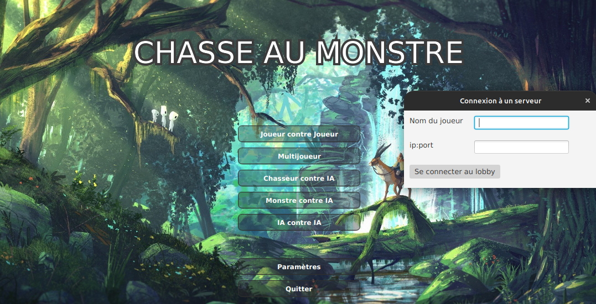

# Chasse Au Monstre

Jeu vidéo graphique basé sur JavaFX, où l'on incarne un chasseur ou un monstre, le chasseur doit tirer sur un labyrinthe afin de trouver le monstre sans connaître ce dernier et le monstre doit pouvoir se déplacer jusqu'à la sortie pour gagner.

| Auteurs  |
| :--------------- |
| EL ATIFI Yliess |
| AOULAD-TAYAB Karim | 
| OUHDDA Anas |
| TAS Atilla |
| HAMZA Sélim|

### Sommaire

- [Livrable 1](#livrable-1)
- [Livrable 2](#livrable-2)

#### Lancement de l'application

Décompressez le fichier 'ChasseAuMonstre-V2.zip' (dernière version du jeu) dans le répertoire 'releases' et à l'intérieur du fichier décompressé éxecutez cette commande:

```
java --module-path [CHEMIN_ABSOLU_VERS_LE_DOSSIER_LIB_DE_JAVAFX] --add-modules javafx.controls,javafx.fxml,javafx.media -jar ChasseAuMonstre.jar
```

#### Consigne de compilation de la doc (+ UML)

```
javadoc -private -author -d doc/chasseaumonstre -cp src/main/resources/cam-player-api-base.jar:src/main/resources/junit-platform-console-standalone-1.10.0.jar --module-path [CHEMIN_VERS_LE_DOSSIER_LIB_DU_SDK_JAVAFX] --add-modules javafx.controls,javafx.fxml,javafx.media -sourcepath src/main/java -docletpath src/main/resources/umldoclet-2.1.0.jar -doclet nl.talsmasoftware.umldoclet.UMLDoclet -subpackages chasseaumonstre
```

## Livrable 1

UML


## Livrable 2

Consignes pour utiliser le mode multi:

- Lancer le serveur MonsterHunterServer au préalable
- Appuyer sur le bouton 'Multijoueur' lors du lancement du jeu
- Écrire le nom du joueur A
- Pour l'ip il y a 2 situations possibles:
    - En localhost (boucle locale): **127.0.0.1:8080** (port en écoute par le serveur)
    - En local (dans le réseau local): **[ipv4_de_la_machine]:8080**
    - À distance (la machine hébergeant le serveur doit configurer un serveur dédié/VPS ou tout simplement faire une redirection de ports à configurer via le routeur) : **[ip_public]:8080**

