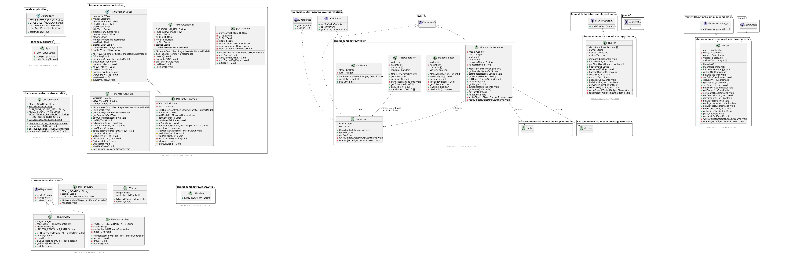

# Chasse Au Monstre

| Auteurs  |
| :--------------- |
| EL ATIFI Yliess |
| AOULAD-TAYAB Karim | 
| OUHDDA Anas |
| TAS Atilla |
| HAMZA Sélim|

### Lancement de l'application

Décompressez le fichier 'ChasseAuMonstre.zip' et à l'intérieur du dossier décompressé éxecutez cette commande:

```
java --module-path [CHEMIN_ABSOLU_VERS_LE_DOSSIER_LIB_DE_JAVAFX] --add-modules javafx.controls,javafx.fxml,javafx.media -jar ChasseAuMonstre.jar
```

### Consigne de compilation de la doc (+ UML)

```
javadoc -private -author -d doc/chasseaumonstre -cp src/main/resources/cam-player-api-base.jar:src/main/resources/junit-platform-console-standalone-1.10.0.jar --module-path [CHEMIN_VERS_LE_DOSSIER_LIB_DU_SDK_JAVAFX] --add-modules javafx.controls,javafx.fxml,javafx.media -sourcepath src/main/java -docletpath src/main/resources/umldoclet-2.1.0.jar -doclet nl.talsmasoftware.umldoclet.UMLDoclet -subpackages chasseaumonstre
```

UML du livrable 1

