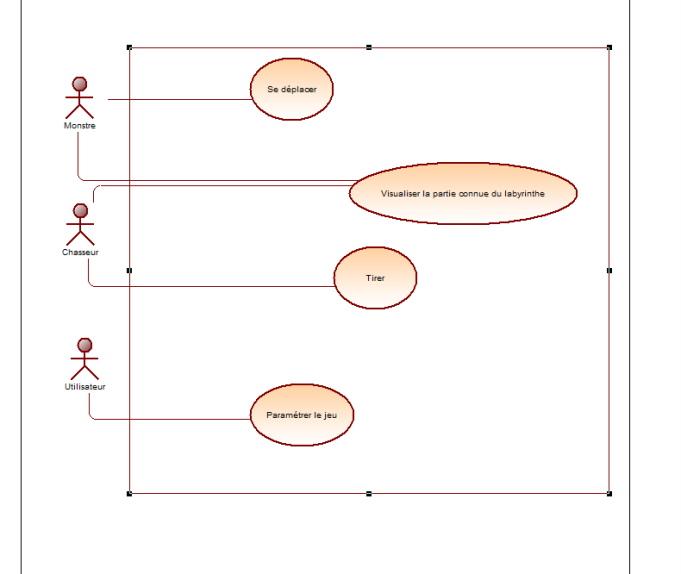
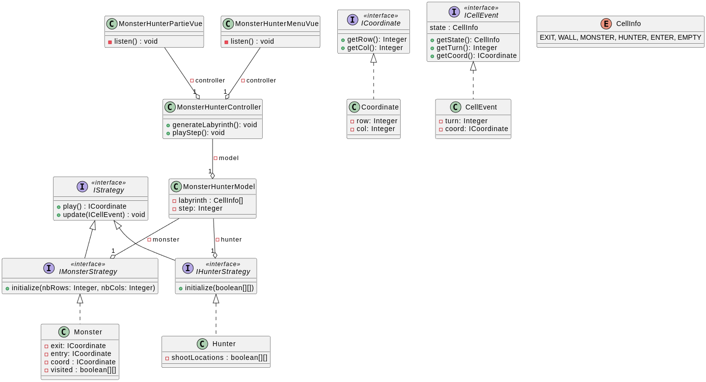

# Rapport d'Analyse Partie 1

Rapport de la première partie d'Analyse, pour la conception du ludogiciel 'Chasse au Monstre' via:
1. diagramme de cas d'utilisation
2. diagramme de classes

On expliquera les détails d'implémentation de la conception orienté-objet du diagramme de classes en seconde partie.

## Partie I : L'UML du logiciel



Le diagramme de cas d'utilisation est très basique, il n'y a pas énormément d'interactions entre les acteurs principaux et le système.

Au départ, nous sommes de simples utilisateurs et nous avons uniquement la possibilité de paramétrer le jeu (ex: choisir notre rôle entre chasseur et monstre).

- Le monstre peut se déplacer et visualiser la partie connue du labyrinthe

- Le chasseur peut tirer dans le plateau (labyrinthe) et également visaliser la partie connue du labyrinthe.

Nous nous concentrerons davantage sur la conception orienté-objet (les designs patterns adéquats, architecture logicielle) sur la suite de ce rapport.



Le diagramme de classe est primordial pour une bonne conception de ce ludogiciel, nous devons nous mettre d'accord sur comment conçevoir le logiciel, étant donné que le logiciel est une interface graphique, nous avons opté pour l'architecture MVC (Modèle-Vue-Contrôleur). 

Également, nous avons une conception minimale imposé par les professeurs qui se base sur le patron Strategy et un ensemble d'interfaces, cela permettra d'intégrer très facilement notre implémentation dans le projet d'un autre groupe afin de faire affronter notre IA contre leur IA (Chasseur ou Monstre) dans le cadre d'un concours d'IA. 

Pour commencer, le MVC se compose d'une Vue, c'est la partie visible par l'utilisateur, ce sont tous les élements graphiques rendus dans la fenêtre et on peut interagir avec certains de ces élements en déclenchant des évènements directement via cette vue. Dans notre cas, la vue c'est la labyrinthe sur lequel un chasseur ou monstre (au tour par tour) interagit. Pour le chasseur ce sera un click de souris sur une cellule particulière et pour le monstre ce sera des évenèments de touche pour se déplacer dans le labyrinthe.

Ensuite, une fois un évènement encleché depuis la vue, la responsabilité est déléguée au contrôleur qui s'occupe de mettre à jour le modèle en invoquant une des méthodes du modèle correspondant à l'action effecutée et ensuite je récupère la nouvelle valeur du modèle pour mettre à jour la vue. Par exemple: si on appuie sur une case en tant que chasseur on tire sur une cellule donc le controlleur suite à cet évènement il invoquera une méthode du modèle qui mettra à jour l'état interne du plateau du côté du chasseur et du monstre et ensuite il mettra à jour la vue avec la nouvelle valeur du modèle.

Donc le modèle sera la partie de l'architecture qui stockera les données donc l'état interne du labyrinthe et aussi celui qui gère toute la logique métier concernant ces données.

Ensuite, comme nous avions mentionné précedemment, la conception minimale imposée se base sur Strategy. C'est un patron qui permet, parmi un ensemble de classes implémentant la même interface de les rendre interchangeables afin de choisir la stratégie adéquate selon la situation. Cela est possible grâce au polymorphisme. Par exemple, la méthode pour jouer son tour n'aura pas le même comportement suivant le rôle. On choisit la "Stratégie" adéquate donc la manière dont le joueur (soit chasseur soit monstre) va interagir avec le labyrinthe.

## Partie II : Description de l'implémentation pour les fonctionnalités principales

Voici les principales méthodes du logiciel:
- [MonsterHunterController.generateLabyrinth() : void](#generateLabyrinth)
- [MonsterHunterPartieVue.listen() : void](#listen)
- [MonsterHunterMenuVue.listen() : void](#listen)
- [MonsterHunterController.playStep() : void](#playStep)
- [MonsterHunterModel.initialize(Integer, Integer) : void](#initialize)
- [MonsterHunterModel.initialize(boolean[][]) : void](#initialize)
- [MonsterHunterModel.play() : ICoordinate](#play)
- [MonsterHunterModel.update(ICellEvent) : void](#update)

## generateLabyrinth

Pour commencer, la méthode generateLabyrinth va génerer (comme son nom l'indique) le labyrinthe sur JavaFX. Le labyrinthe sera généré aléatoirement mais il faut évidemment faire en sorte qu'il y a un chemin entre l'entrée et la sortie. Il faut aussi au préalable initialiser l'état du chasseur et monstre, via ces méthodes:
- [MonsterHunterModel.initialize(Integer, Integer) : void](#initialize-monster)
- [MonsterHunterModel.initialize(boolean[][]) : void](#initialize-hunter)

Pseudo-code:
```
Procédure generateLabyrinth Alors
    Initialiser Modele <- Récuperer le modèle depuis le contrôleur
    Initialiser Labyrinthe <- Modele.getLabyrinth()
    Appliquer l'algorithme de Prim pour la génération de labyrinthe
    Déclarer posX, posY
    Affecter une des coordonnées possibles suivant Labyrinthe à posX, posY
    MonsterHunterModel.initialize(posX, posY)
    MonsterHunterModel.initialize(Tableau 2D de booléen)
    Affecter le résultat de l'algorithme à Labyrinthe
Fin Procédure
```

## listen

Les méthodes listen des 2 vues (MonsterHunterPartieVue, MonsterHunterMenuVue) permettent d'écouter sur un ensemble d'évènements que l'utilisateur pourrait enclencher.

Pseudo-code (pour MonsterHunterMenuVue):
> MonsterHunterVue c'est la vue qui affiche le menu dans lequel les 2 joueurs devront se décider pour être soit chasseur ou monstre avec leur nom respectif
```
Procédure listen Alors
    Écouter sur la TextProperty (JavaFX) afin d'être notifié de chaque changement 
    de valeur dans les 2 champs, utiles pour inscrire le nom des 2 joueurs

    Écouter l'évènement des clicks de souris sur un bouton 'valider' pour passer à la vue suivante (MonsterHunterPartieVue)
Fin Procédure
```

Pseudo-code (pour MonsterHunterPartieVue):
```
Procédure listen Alors
    Si c'est au tour du chasseur Alors
        Écouter l'évènement des clicks de souris pour une cellule du labyrinthe
    Sinon
        Écouter sur l'évènement d'une touche directionnelle du clavier pour se déplacer dans la grille du labyrinthe
Fin Procédure
```

## playStep

La méthode playStep tire bénéfice du patron Strategy pour décider de quel comportement choisir en fonction du rôle du joueur, il sera invoqué suite à un évènement.

```
# Les paramètres x et y proviennent des coordonnées capturées de l'évènement JavaFX
Procédure playStep(Integer x, Integer y) Alors
    Initialiser Modele <- Récuperer le modèle depuis le contrôleur
    Initialiser Labyrinthe <- Modele.getLabyrinth()

    Déclarer un objet strategy de type IStrategy
    Si c'est le tour du Chasseur Alors
        strategy = Modele.getChasseur()
    Sinon
        strategy = Modele.getMonstre()
    
    Initialiser coord de type ICoordinate <- strategy.play()
    Initialiser cellInfo = Labyrinthe[coord.getRow()][coord.getCol()]
    strategy.update(Instancier CellEvent avec cellInfo, Modele.getStep(), coord)
Fin Procédure
```

## initialize

Les méthodes initialize implémentées par les classes Monster et Hunter, permettent d'initialiser l'état initial du monstre et chasseur respectivement (ex: la position initiale du monstre)

```
Procédure initialize(Integer nbRows, Integer nbCols) Alors
    coord.setRow(nbRows)
    coord.setCols(nbCols)
Fin Procédure
```

```
Procédure initialize(boolean[][] locations) Alors
    shootLocations = locations
Fin Procédure
```

## play

La méthode play c'est la méthode qui marque la position du monstre ou le tir du chasseur suite à l'évènement du chasseur, monstre et renvoie ainsi les coordonnées.

Par exemple: la classe Monstre
```
Fonction play() Renvoie ICoordinate Alors
    Récupère les coordonnées et les assigne dans coord
    Renvoie les coordonnées de type ICoordinate
Fin Procédure
```

## update

La méthode update va modifier l'état du chasseur et du monstre

Par exemple: la classe Monstre
```
Procédure update(ICellEvent event) Alors
    Initialiser coord <- event.getCoord()
    visited[coord.getRow()][coord.getCol()] = true
Fin Procédure
```