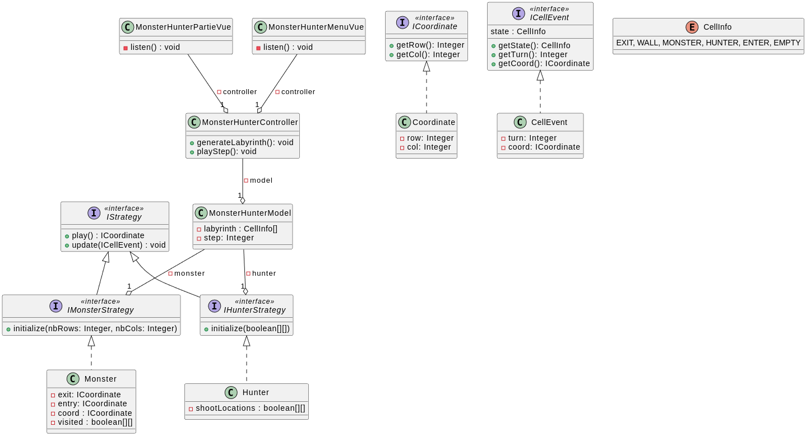

# Rapport d'Analyse Partie 1

Rapport de la première partie d'Analyse, pour la conception du ludogiciel 'Chasse au Monstre' via:
1. diagramme de cas d'utilisation
2. diagramme de classes

On expliquera les détails d'implémentation de la conception orienté-objet du diagramme de classes en seconde partie.

## Partie I : L'UML du logiciel

Le diagramme de cas d'utilisation est très basique, il n'y a pas énormément d'interactions entre les acteurs principaux et le système.

Au départ, nous sommes de simples utilisateurs et nous avons uniquement la possibilité de paramétrer le jeu (ex: choisir notre rôle entre chasseur et monstre).

- Le monstre peut se déplacer et visualiser la partie connue du labyrinthe

- Le chasseur peut tirer dans le plateau (labyrinthe) et également visaliser la partie connue du labyrinthe.

Nous nous concentrerons davantage sur la conception orienté-objet (les designs patterns adéquats, architecture logicielle) sur la suite de ce rapport.

Le diagramme de classe est primordial pour une bonne conception de ce ludogiciel, nous devons nous mettre d'accord sur comment conçevoir le logiciel, étant donné que le logiciel est une interface graphique, nous avons opté pour l'architecture MVC (Modèle-Vue-Contrôleur). 

Également, nous avons une conception minimale imposé par les professeurs qui se base sur le patron Strategy et un ensemble d'interfaces, cela permettra d'intégrer très facilement notre implémentation dans le projet d'un autre groupe afin de faire affronter notre IA contre leur IA (Chasseur ou Monstre) dans le cadre d'un concours d'IA. 

Pour commencer, le MVC se compose d'une Vue, c'est la partie visible par l'utilisateur, ce sont tous les élements graphiques rendus dans la fenêtre et on peut interagir avec certains de ces élements en déclenchant des évènements directement via cette vue. Dans notre cas, la vue c'est la labyrinthe sur lequel un chasseur ou monstre (au tour par tour) interagit. Pour le chasseur ce sera un click de souris sur une cellule particulière et pour le monstre ce sera des évenèments de touche pour se déplacer dans le labyrinthe.

Ensuite, une fois un évènement encleché depuis la vue, la responsabilité est déléguée au contrôleur qui s'occupe de mettre à jour le modèle en invoquant une des méthodes du modèle correspondant à l'action effecutée et ensuite je récupère la nouvelle valeur du modèle pour mettre à jour la vue. Par exemple: si on appuie sur une case en tant que chasseur on tire sur une cellule donc le controlleur suite à cet évènement il invoquera une méthode du modèle qui mettra à jour l'état interne du plateau du côté du chasseur et du monstre et ensuite il mettra à jour la vue avec la nouvelle valeur du modèle.

Donc le modèle sera la partie de l'architecture qui stockera les données donc l'état interne du labyrinthe et aussi celui qui gère toute la logique métier concernant ces données.

Ensuite, comme nous avions mentionné précedemment, la conception minimale imposée se base sur Strategy. C'est un patron qui permet, parmi un ensemble de classes implémentant la même interface de les rendre interchangeables afin de choisir la stratégie adéquate selon la situation. Cela est possible grâce au polymorphisme. Par exemple, la méthode pour jouer son tour n'aura pas le même comportement suivant le rôle. On choisit la "Stratégie" adéquate donc la manière dont le joueur (soit chasseur soit monstre) va interagir avec le labyrinthe.

## Partie II : Description de l'implémentation pour les fonctionnalités principales

# Fonction initializeLabyrinth() : void
    // Initialisation du labyrinthe
    Si labyrinthe_aléatoire {
        GénérerLabyrintheAléatoire()
    } Sinon {
        ChargerLabyrinthePrédéfini()
    }
    Positionsortie ← DéfinirPositionDépartsortie()
    PositionMonstre ← DéfinirPositionDépartMonstre()

# Fonction shoot(coordinate: Coordinate) : CellInfo
    // Chasseur tire sur la case à 'coordinate'
    Case ← ObtenirCase(coordinate)
    Si Case jamais explorée {
        MarquerCaseExplorée(coordinate)
        Si Case occupée par le monstre {
            Retourner CellInfo.GAGNÉ
        }
        Sinon Si Case occupée par un obstacle {
            Retourner CellInfo.OBSTACLE
        }
        Sinon {
            Retourner CellInfo.SANS_MONSTRE
        }
    } Sinon {
        Retourner CellInfo.DÉJÀ_EXPLORÉE
    }

# Fonction playStep() : vide
    // Passage au tour suivant du chasseur
    MettreÀJourVueJeu()
    Si Chasseur a atteint la sortie {
        SignaléVictoireChasseur()
    }

# Fonction initialize(nbRows: Entier, nbCols: Entier) : vide
    // Initialisation de la stratégie du monstre
    NombreLignes ← nbRows
    NombreColonnes ← nbCols
    PositionMonstre ← PositionInitialeMonstre()

# Fonction moveMonster(coordinate: Coordinate) : CellInfo
    // Déplacement du monstre vers la case adjacente à 'coordinate'
    NouvellePosition ← TrouverCaseAdjacenteLibre(coordinate)
    MettreÀJourPositionMonstre(NouvellePosition)
    Retourner ÉtatNouvelleCase(NouvellePosition)

``
