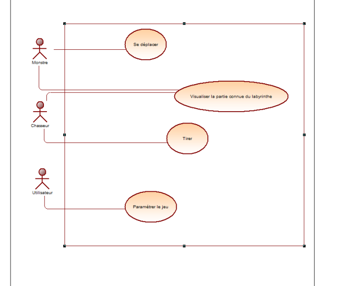

# Rapport d'Analyse Partie 1

Rapport de la première partie d'Analyse, pour la conception du ludogiciel 'Chasse au Monstre' via:
1. diagramme de cas d'utilisation
2. diagramme de classes

On expliquera les détails d'implémentation de la conception orienté-objet du diagramme de classes en seconde partie.

## Partie I : L'UML du logiciel

Le diagramme de cas d'utilisation est très basique, il n'y a pas énormément d'interactions entre les acteurs principaux et le système.

Au départ, nous sommes de simples utilisateurs et nous avons uniquement la possibilité de paramétrer le jeu (ex: choisir notre rôle entre chasseur et monstre).

- Le monstre peut se déplacer et visualiser la partie connue du labyrinthe

- Le chasseur peut tirer dans le plateau (labyrinthe) et également visaliser la partie connue du labyrinthe.

Nous nous concentrerons davantage sur la conception orienté-objet (les designs patterns adéquats, architecture logicielle) sur la suite de ce rapport.